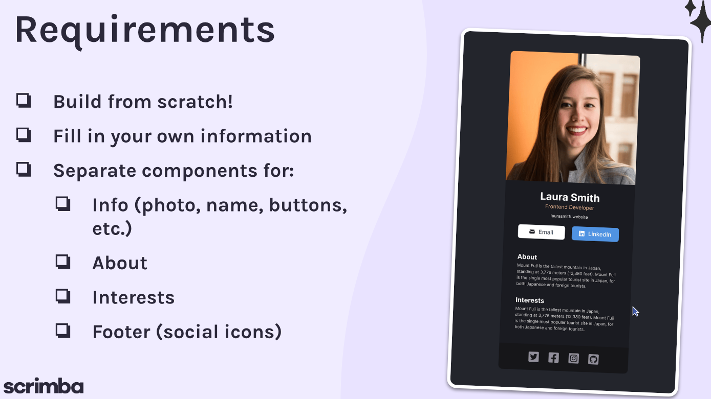

# 🚀 Digital Business Card

> Biglietto da visita digitale realizzato in React come esercizio del corso React di Scrimba.




---

## 🌟 Caratteristiche principali

- Foto profilo, nome e ruolo professionale.
- Link rapidi a **e-mail** e **LinkedIn**.
- Sezione **About** con presentazione personale.
- Sezione **Interests** con i propri interessi.
- Footer con copyright.

---

## 🛠️ Tech Stack

| Tecnologia          | Scopo                              |
| :------------------ | :--------------------------------- |
| **React 19**        | Framework UI, gestione componenti  |
| **Vite**            | Build tool e dev server            |
| **Bootstrap Icons** | Icone vettoriali                   |

---

## 🚀 Quick Start

### Requisiti

Prima di iniziare, assicurati di avere installato:

- Node.js (v18+)
- npm

### Installazione

```bash
# Clona il repository
git clone https://github.com/mirkobechini/digital-business-card.git

# Entra nella cartella del progetto
cd digital-business-card

# Installa le dipendenze
npm install
```

### Avvio

```bash
npm run dev
```

Apri il browser su `http://localhost:5173`.

---

## 📂 Struttura del progetto

```text
.
├── public/
├── src/
│   ├── assets/
│   │   └── images/          # Immagini (es. foto profilo)
│   ├── components/
│   │   ├── Info.jsx          # Foto, nome, ruolo e link di contatto
│   │   ├── About.jsx         # Sezione presentazione
│   │   ├── Interests.jsx     # Sezione interessi
│   │   └── Footer.jsx        # Footer con copyright
│   ├── App.jsx
│   ├── App.css
│   ├── main.jsx
│   └── index.css
├── index.html
├── package.json
└── vite.config.js
```

---

## 🗺️ Roadmap

- [x] Struttura base con componenti React
- [x] Link e-mail e LinkedIn
- [x] Aggiunta icone Bootstrap Icons ai link
- [ ] Completamento sezione Interests
- [ ] Deploy su GitHub Pages

---

## 📄 Licenza

Distribuito sotto licenza MIT. Vedi il file `LICENSE` per i dettagli.

---

## 📧 Contatti

Mirko Bechini - [LinkedIn](https://www.linkedin.com/in/mirko-bechini-892202252) - mirkobechini@gmail.com

Link progetto: https://github.com/mirkobechini/digital-business-card
